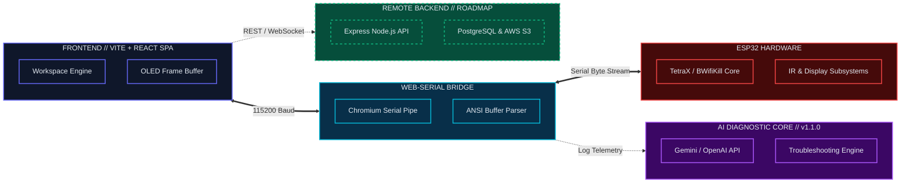

# SATAN // SYSTEM ARCHITECTURE & TERMINAL ANALYSIS NODE
**Version 1.1.0**

Universal WebSerial Terminal and Control Interface for ESP32 Microcontrollers.

---

## SYSTEM ARCHITECTURE & TOPOLOGY

The following diagram illustrates the complete data flow from the client frontend, through the browser sandbox bridge, into the AI diagnostic core, down to the microcontroller hardware, and the planned remote backend infrastructure.

---

## WHAT'S NEW IN v1.1.0

* **AI Diagnostics Integration (Gemini / OpenAI API)**
  Implemented real-time console log diagnostics and auto-troubleshooting loop via LLM adapters. Initially planned for future roadmap, fully deployed in v1.1.0.

* **Multi-Profile Layout Switcher**
  Create, switch, rename, and delete layout profiles directly from the tab manager bar.

* **Mouse Multi-Selection Mode**
  Accumulate selections by clicking on panels without needing key modifiers.

* **Keyboard Arrow Key Navigation**
  Precise 1px nudges (or 10px with Shift held) using Arrow keys.

* **Smart Snapping & Spacing Rules**
  Snap margins automatically to 16px and 24px, display alignment axes, and spacing indicators.

* **Layout Safety & Health Score**
  Live evaluation score displaying spacing imbalances, edge boundary crossings, and overlap errors.

---

## UPCOMING ROADMAP

* **v1.2.0: Web Firmware Flasher (WebSerial)**
  Drag-and-drop compilation binaries directly into browser to write and flash over the bootloader.

* **v1.3.0: Universal Device Profiles**
  Standardized handshake auto-detecting connected hardware variants (TetraX, Blue-Box, BruceForce) and loading corresponding sub-panels.

* **v1.4.0: OTA Update Orchestration**
  Initiate secure WiFi network firmware rollouts directly from the control console.

* **v1.5.0: Multi-Device Dashboard**
  Simultaneously connect and view multiple ESP32 devices on a split-screen layout with fleet command broadcast capability.

* **v2.0.0: Node.js Backend & Fleet Database**
  Centralized database tracking hardware logs, client fleet mappings, and multi-tenant security profiles.

---

## TECH STACK

| Component | Technology |
|-----------|-----------|
| Frontend | React 19, TypeScript |
| Styling | Tailwind CSS v4 |
| Build System | Vite 6 |
| Serial Interface | WebSerial API |

---

**PROJECT**: TETRAX / BWIFIKILL
**DEVELOPER**: MXSOURAV
